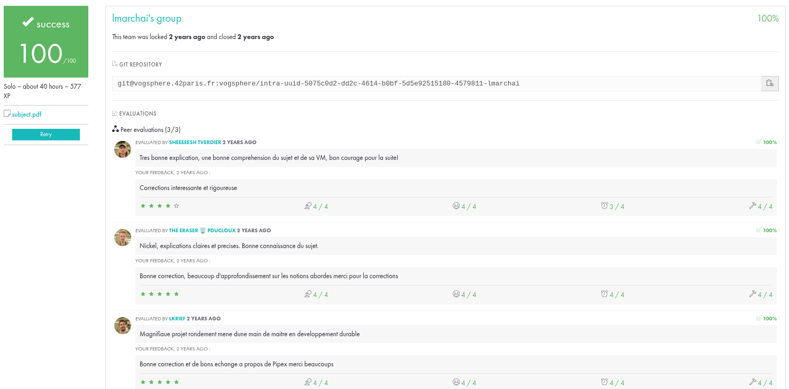

# Born2beroot

## Introduction
Born2beroot est un projet du cursus de l'école 42. L'objectif de ce projet est de configurer une machine virtuelle avec des exigences spécifiques en matière de sécurité et d'administration système.

## Objectifs
- Installer et configurer une machine virtuelle.
- Mettre en œuvre des mesures de sécurité.
- Gérer les utilisateurs et les groupes.
- Configurer un pare-feu.
- Assurer la stabilité et la sécurité du système.

## Exigences
- Utiliser une distribution basée sur Debian ou Red Hat.
- Configurer le système pour utiliser LVM (Logical Volume Manager).
- Mettre en place une politique de mot de passe robuste.
- Implémenter SSH pour un accès distant sécurisé.
- Configurer un pare-feu en utilisant `ufw` ou `firewalld`.
- Créer et gérer des comptes utilisateurs avec des permissions spécifiques.
- Assurer que le système est à jour et sécurisé.

## Étapes
1. **Installer le système d'exploitation** : Choisissez une distribution basée sur Debian ou Red Hat et installez-la sur votre machine virtuelle.
2. **Configurer LVM** : Configurez le Logical Volume Manager pendant le processus d'installation.
3. **Configurer les utilisateurs et les groupes** : Créez des comptes utilisateurs et des groupes avec les permissions appropriées.
4. **Mettre en œuvre des mesures de sécurité** :
    - Configurer SSH pour un accès distant sécurisé.
    - Mettre en place une politique de mot de passe robuste.
    - Installer et configurer un pare-feu (`ufw` ou `firewalld`).
5. **Maintenance du système** : Mettez régulièrement à jour le système et assurez-vous qu'il est sécurisé.

