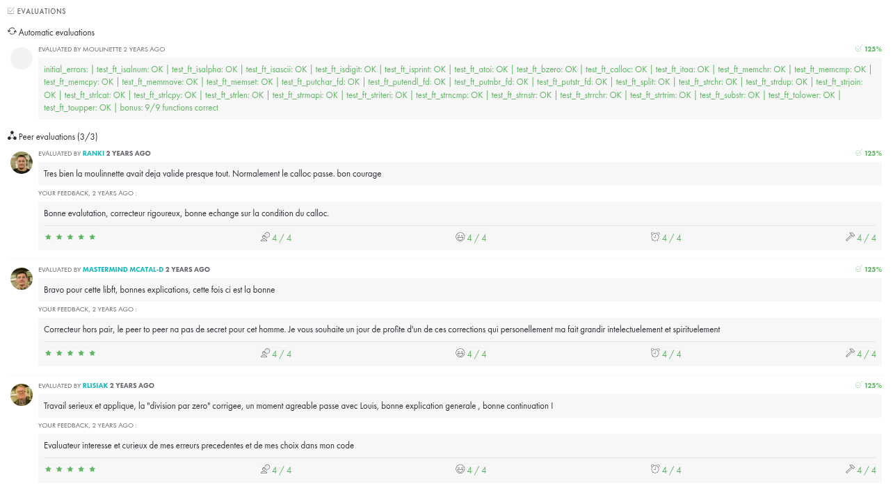

## Projet LIBFT à l'école 42

Le projet LIBFT est l'un des premiers projets du cursus à l'école 42. Il consiste à recréer une bibliothèque standard en C, appelée `libft`, qui contient des fonctions couramment utilisées dans de nombreux programmes. L'objectif principal de ce projet est d'apprendre et de maîtriser les bases de la programmation en C, ainsi que de comprendre le fonctionnement interne des fonctions de la bibliothèque standard.

### Objectifs du projet

- **Compréhension des fonctions de la bibliothèque standard** : En recréant ces fonctions, les étudiants apprennent comment elles sont implémentées et comment elles fonctionnent en interne.
- **Gestion de la mémoire** : Les étudiants doivent gérer la mémoire de manière efficace et éviter les fuites de mémoire.
- **Bonnes pratiques de codage** : Le projet encourage les bonnes pratiques de codage, y compris la gestion des erreurs et l'écriture de code propre et lisible.
- **Utilisation de Git** : Les étudiants apprennent à utiliser Git pour gérer leur code source et suivre les modifications.

### Contenu de la bibliothèque

La `libft` comprend des fonctions pour :

- La manipulation de chaînes de caractères (par exemple, `ft_strlen`, `ft_strcpy`)
- La gestion de la mémoire (par exemple, `ft_memset`, `ft_memcpy`)
- La manipulation de listes chaînées (par exemple, `ft_lstnew`, `ft_lstadd`)
- D'autres utilitaires courants (par exemple, `ft_atoi`, `ft_isalpha`)

### Conclusion

Le projet LIBFT est une étape essentielle dans le parcours à l'école 42. Il permet de développer des compétences fondamentales en programmation et de se préparer pour des projets plus complexes à venir ainsi que de rappeler les notions vues en piscine.

### Commentaires
