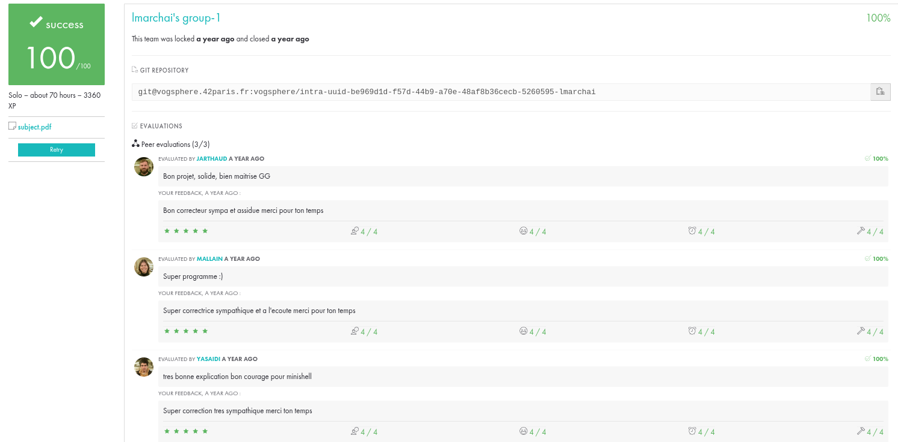

# Projet Philosophers

## Introduction

Le projet Philosophers est un exercice classique en informatique qui illustre les problèmes de synchronisation et de concurrence. Il s'agit de simuler un scénario où plusieurs philosophes sont assis autour d'une table et alternent entre manger, penser et dormir. Le défi consiste à gérer l'accès concurrent aux ressources partagées (les fourchettes) de manière à éviter les conditions de course et les interblocages.

## Objectifs

- Comprendre les concepts de base de la concurrence et de la synchronisation.
- Apprendre à utiliser les mutex et les sémaphores pour gérer l'accès aux ressources partagées.
- Implémenter une solution qui évite les interblocages et les conditions de famine.

## Règles

1. Il y a cinq philosophes assis autour d'une table circulaire.
2. Chaque philosophe a une fourchette à sa gauche et une à sa droite.
3. Pour manger, un philosophe doit avoir les deux fourchettes.
4. Les philosophes alternent entre les états de penser, manger et dormir.
5. Un philosophe ne peut pas prendre une fourchette qui est déjà prise par un autre philosophe.

## Compilation et Exécution

Pour compiler le projet, utilisez la commande suivante :

```sh
make
```

Pour exécuter le programme, utilisez la commande suivante :

```sh
./philosophers [nombre_de_philosophes] [temps_pour_manger] [temps_pour_penser] [temps_pour_dormir]
```

## Exemple

```sh
./philosophers 5 800 200 200
```

## Commentaires
