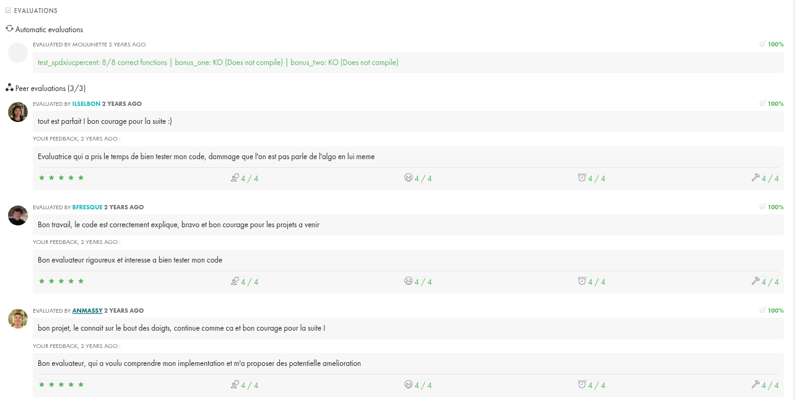

# Projet ft_printf - École 42

Le projet `ft_printf` de l'École 42 consiste à recréer la fonction `printf` de la bibliothèque standard C. Cette fonction est utilisée pour afficher des chaînes de caractères formatées sur la sortie standard. Le but de ce projet est de comprendre en profondeur le fonctionnement de `printf` et de renforcer les compétences en programmation C.

## Prototype de la Fonction 
```c
int	ft_printf(char	*str, ...);
```

## Objectifs du projet

- Comprendre le fonctionnement interne de `printf`.
- Manipuler les chaînes de caractères et les arguments variadiques.
- Gérer différents types de formatage (entiers, caractères, chaînes, hexadécimal, etc.).
- Améliorer les compétences en débogage et en gestion de la mémoire.

## Notions Apprises
- Utilisation des arguments variadiques avec `va_list`, `va_start`, `va_arg` et `va_end`.
- Gestion de la mémoire et prévention des fuites de mémoire.
- Manipulation avancée des chaînes de caractères.
- Conversion de différents types de données en chaînes de caractères.
- Gestion des erreurs et des cas limites.
- Lecture et compréhension de la documentation technique.

## Fonctionnalités à implémenter

- Gestion des spécificateurs de format de base : `%c`, `%s`, `%p`, `%d`, `%i`, `%u`, `%x`, `%X`. ,`%%`

## Ressources

- [Documentation de la fonction printf](https://man7.org/linux/man-pages/man3/printf.3.html)
- [Tutoriel sur les arguments variadiques en C](https://www.cprogramming.com/tutorial/c/lesson17.html)

## Commentaire 
