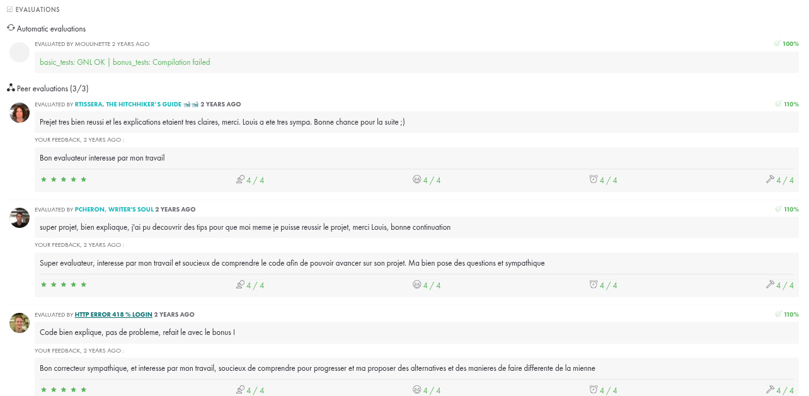

# Get Next Line

## Introduction

Le projet `get_next_line` est le second projet du cursus de l'école 42. L'objectif de ce projet est de créer une fonction qui lit une ligne à partir d'un descripteur de fichier et la retourne. Cette fonction doit être capable de gérer plusieurs descripteurs de fichiers en même temps et de gérer la mémoire efficacement.

## Prototype de la Fonction

```c
char *get_next_line(int fd);
```

- `fd` : Le descripteur de fichier à partir duquel lire.

## Notions Apprises

- **Gestion de la mémoire** : Apprendre à allouer et libérer dynamiquement de la mémoire pour éviter les fuites de mémoire.
- **Manipulation des fichiers** : Utiliser les fonctions de la bibliothèque standard pour ouvrir, lire et fermer des fichiers.
- **Gestion des erreurs** : Implémenter une gestion robuste des erreurs pour traiter les cas où la lecture échoue ou où la mémoire ne peut pas être allouée.
- **Utilisation des buffers** : Comprendre comment utiliser des tampons pour lire efficacement des données à partir d'un descripteur de fichier.
- **Variables statiques** : Utiliser des variables statiques pour conserver l'état entre les appels de fonction.
- **Programmation modulaire** : Diviser le code en fonctions et modules réutilisables pour améliorer la lisibilité et la maintenabilité.

## Exigences

- La fonction doit retourner une ligne lue à partir du descripteur de fichier, y compris le caractère de nouvelle ligne, si présent.
- La fonction doit retourner `NULL` lorsqu'il n'y a plus rien à lire ou en cas d'erreur.
- La fonction doit être capable de gérer plusieurs descripteurs de fichiers simultanément.
- La fonction doit gérer la mémoire efficacement et éviter les fuites.
- Gestion de la norme de 42 (fonctions de 25 lignes, 5 fonctions max par fichier, et 2 fichiers)

## Détails de l'Implémentation

- Utiliser une variable statique pour stocker le reste du tampon entre les appels de fonction.
- Lire à partir du descripteur de fichier dans une boucle jusqu'à ce qu'un caractère de nouvelle ligne soit trouvé ou que la fin du fichier soit atteinte.
- Allouer dynamiquement de la mémoire pour la ligne à retourner.
- Assurer une gestion correcte des erreurs et de la mémoire.

## Exemple d'Utilisation

```c
#include <fcntl.h>
#include <stdio.h>
#include "get_next_line.h"

int main(void)
{
    int fd = open("example.txt", O_RDONLY);
    char *line;

    while ((line = get_next_line(fd)) != NULL)
    {
        printf("%s", line);
        free(line);
    }
    close(fd);
    return (0);
}
```


## Axes d'Amélioration

### get_next_line.c

- **Optimisation de la lecture** : Améliorer l'efficacité de la lecture en ajustant la taille du tampon ou en utilisant des techniques de lecture asynchrone.
- **Gestion des erreurs** : Ajouter des vérifications supplémentaires pour les erreurs potentielles lors de la lecture et de l'allocation de mémoire.
- **Refactorisation du code** : Simplifier et clarifier le code en divisant les fonctions complexes en sous-fonctions plus petites et plus gérables.

### get_next_line_utils.c

- **Optimisation des fonctions utilitaires** : Améliorer les performances des fonctions utilitaires en réduisant le nombre d'appels de fonctions et en optimisant les boucles.
- **Gestion de la mémoire** : Assurer que toutes les fonctions utilitaires gèrent correctement la mémoire pour éviter les fuites et les dépassements de tampon.
- **Tests unitaires** : Ajouter des tests unitaires pour chaque fonction utilitaire afin de garantir leur bon fonctionnement et leur robustesse.

### get_next_line.h

- **Documentation** : Ajouter des commentaires détaillés pour chaque fonction et macro afin de faciliter la compréhension et la maintenance du code.
- **Modularité** : Réorganiser les définitions et les déclarations pour améliorer la modularité et la réutilisabilité du code.
- **Compatibilité** : Assurer que le fichier d'en-tête est compatible avec différents compilateurs et environnements en utilisant des directives de préprocesseur appropriées.

## Commentaires
