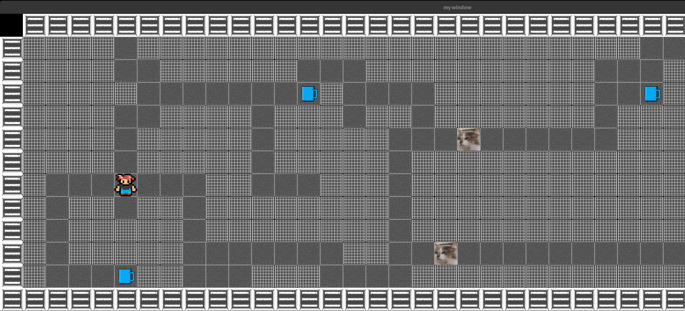
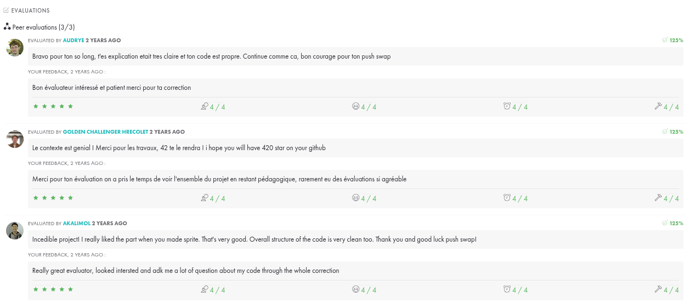

# so_long

## Description
`so_long` est un projet de l'école 42 qui consiste à créer un petit jeu en utilisant la bibliothèque graphique MiniLibX. Le but du jeu est de déplacer un personnage à travers une carte pour collecter des objets et atteindre la sortie.

## Commandes du jeu
- `W` : Déplacer vers le haut
- `A` : Déplacer vers la gauche
- `S` : Déplacer vers le bas
- `D` : Déplacer vers la droite
- `ESC` : Quitter le jeu

## Structure du projet
- `src/` : Contient les fichiers sources du projet
- `include/` : Contient les fichiers d'en-tête
- `maps/` : Contient les fichiers de carte `.ber`
- `assets/` : Contient les ressources graphiques

## Notions Apprises

### Programmation en C
- **Gestion de la mémoire** : Utilisation de malloc, free, et gestion des fuites de mémoire.
- **Manipulation de pointeurs** : Compréhension et utilisation des pointeurs pour accéder et manipuler les données.
- **Structures** : Création et utilisation de structures pour organiser les données du jeu.

### Bibliothèque MiniLibX
- **Chargement et affichage d'images** : Utilisation de MiniLibX pour charger des images et les afficher à l'écran.
- **Gestion des événements** : Capture et gestion des événements clavier pour déplacer le personnage et quitter le jeu.
- **Fenêtrage** : Création et gestion d'une fenêtre de jeu.

### Algorithmes
- **Parcours de graphes** : Utilisation d'algorithmes pour vérifier la validité des cartes et trouver des chemins. (Breadth First Search & Depth First Search)
- **Gestion des collisions** : Détection et gestion des collisions entre le personnage et les objets ou les murs.

### Développement de jeux
- **Conception de niveaux** : Création de cartes de jeu avec des fichiers `.ber`.
- **Logique de jeu** : Implémentation des règles du jeu, comme la collecte d'objets et la détection de la victoire.

### Outils et bonnes pratiques
- **Makefile** : Utilisation de Makefile pour automatiser la compilation du projet.
- **Débogage** : Utilisation d'outils de débogage pour identifier et corriger les erreurs.
- **Documentation** : Écriture de documentation pour expliquer le code et le projet.

## Contexte du jeu
- Le développement artistique est inspiré des anciens locaux de l'école 42 et du fait qu'il manquait toujours des gobelets pour boire du café. Il faut donc aller chercher les gobelets sur la carte avant d'aller à la machine à café.
- Dans la version bonus, Norminet, ancienne mascotte de 42, vous pourchasse. Si il vous touche, la partie est terminée.

## Commentaires

